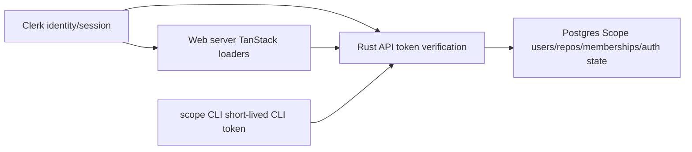

# Auth Boundary, Scope Users, And CLI Device Login Design

## Summary

This PR makes auth boring and owned by clear boundaries:

- Clerk owns browser login identity and sessions.
- Scope owns users, repos, memberships, roles, permissions, and CLI sessions.
- Web uses Clerk only to acquire a server-side API token and render UI chrome.
- API converts all accepted credentials into an internal Scope user/principal.
- CLI device login state and CLI access sessions are persisted in Postgres.

This supersedes the earlier CLI/Clerk design note that used Clerk user IDs as
local `UserAccount.id` values. Scope user IDs become the only IDs used by
domain records.

This is a destructive pre-alpha change. Existing metadata may be reset instead
of migrated.

## Goals

- Remove signed-out dashboard flicker on `/`.
- Remove scattered web token/header handling.
- Require a dedicated Clerk token contract for API calls.
- Stop Clerk subjects from leaking into repo ownership and permissions.
- Give API routes one auth boundary that resolves credentials to Scope users.
- Persist CLI device login and CLI access sessions in Postgres so multiple API
  instances can handle the flow.
- Keep CLI tokens short-lived. Do not add long-lived auth.
- Delete the old auth flow and its tests/types instead of leaving dead code
  behind.

## Non-Goals

- No backwards compatibility for existing `scope_users.id = Clerk user id`
  records.
- No account merging by email.
- No Clerk organization/RBAC adoption.
- No long-lived refresh-token or machine-token auth.
- No redesign of repo permission rules beyond replacing external identity IDs
  with internal Scope user IDs.

## Target Architecture



The important boundary is inside the API:

```text
Authorization header
  -> verify credential kind
  -> resolve or create Scope user
  -> return ScopePrincipal
  -> route/domain behavior
```

Routes should not decide whether a user came from Clerk browser auth or a CLI
access token. They receive a Scope user or a public principal. Credential
exchange routes are the exception: CLI device-login completion must require a
fresh Clerk credential and must reject CLI access tokens.

## Old Auth Flow Removal

This PR must remove the previous auth flow, not wrap it.

Remove these old paths completely:

- Web dashboard signed-out state:
  - `home.signedIn` in API/web types.
  - Signed-out home dashboard rendering.
  - Client-side `useUser()` reconciliation/invalidation used to correct stale
    signed-in state after render.
- Scattered web token helpers:
  - `readRequestAuthToken()` as a generic export used by feature API modules.
  - `authHeaders()` as a public helper that callsites compose manually.
  - Repeated feature-level `getToken()` calls in loaders/actions.
- Generic Clerk-as-API-credential behavior:
  - API acceptance of generic browser/session tokens that do not carry the
    dedicated Scope API audience.
  - Tests that imply any valid Clerk session token is enough for API access.
- Clerk-subject-as-user-id behavior:
  - `identity_user_id()` returning a Clerk subject as the app user ID.
  - `ensure_user_for_identity()` as a route-level helper.
  - Tests asserting Clerk user IDs are local account IDs.
- Email-derived principal behavior:
  - `VerifiedEmail` as an auth principal input.
  - `verified_user_for_email()`.
  - Domain or state helpers that turn verified emails into repo principals.
- Production in-memory CLI auth state:
  - `DeviceLoginStore` as process-local production storage.
  - In-memory CLI access-session lookup from `http_identity()`.
  - Tests that only prove process-memory login durability.

After the PR, old helpers and names should be deleted. A name may survive only
when it is actively rewritten as part of the new Scope-user auth boundary, not
as a shim around old semantics. Public exports, route callsites, tests, and docs
must use the new Scope-user auth boundary language.

## Web Auth

`/` becomes an authenticated dashboard.

- Add a server `beforeLoad` auth gate for `/`.
- Redirect unauthenticated users to the sign-in route.
- Make `/sign-in` the canonical redirect target. Keep Clerk's catch-all sign-in
  handler behind that path only where the router requires it for Clerk's nested
  auth URLs.
- Remove `home.signedIn` from API types and loader state.
- Remove the signed-out branch from the home dashboard and repo list.
- Keep the authenticated empty state with CLI install and `scope init`.
- Use Clerk client hooks only for UI chrome such as `UserButton`.

Loaders and server functions should not use client Clerk state to decide whether
dashboard data exists.

## Web API Client

Create one server-side API client for web-to-API calls.

Callsites should make auth behavior explicit:

```ts
api.get('/v1/repos', { auth: 'required' })
api.get('/v1/repos/:owner/:repo', { auth: 'optional' })
api.post('/v1/repos', { auth: 'required', body })
```

Auth modes:

- `required`: get a Clerk API token; fail before fetch if unavailable.
- `optional`: attach a token when one is available; send no auth otherwise.
- `none`: never attach auth.

The helper should fetch the Clerk API token once per server function/request and
reuse it for parallel API calls. This avoids multiple `getToken({ template })`
calls inside one loader.

## Clerk API Token Contract

Configure a dedicated Clerk JWT template for the Scope API.

Expected contract:

- Template name: `scope_api`.
- Audience: `scope-api`.
- API verifies issuer.
- API verifies audience and defaults the allowed API audience to `scope-api`.
- API verifies authorized party when present/configured.
- API rejects generic Clerk session/browser tokens that do not satisfy the API
  audience contract.

The web app asks Clerk for the API token with the template and sends it as
`Authorization: Bearer <token>`.

CLI tokens remain separate opaque tokens with the `scope_cli_` prefix and are
not Clerk JWTs.

## Scope User Model

Replace the current implicit `Clerk user id == Scope user id` model with an
internal identity mapping.

```text
scope_users
  id
  handle
  email
  email_verified
  access

scope_auth_identities
  provider
  subject
  user_id
```

For Clerk:

```text
provider = "clerk"
subject = Clerk sub, for example "user_abc123"
user_id = internal Scope user id, for example "scope_usr_..."
```

Rules:

- `scope_auth_identities(provider, subject)` is unique.
- `scope_auth_identities.user_id` references `scope_users.id`.
- Same Clerk subject always resolves to the same Scope user.
- Different Clerk subjects never merge because they share email.
- Email is only a profile snapshot from Clerk claims.
- Handle generation remains local and unique.
- Repos, memberships, policies, first-push tokens, git tokens, commits, staged
  updates, and CLI sessions reference Scope user IDs.

Because this is pre-alpha, the schema can reset destructively when this shape is
introduced.

## API Auth Boundary

Replace route-level calls such as `ensure_user_for_identity()` with auth boundary
helpers.

Proposed API surface:

```rust
require_scope_user(state, headers) -> ScopeUser
optional_scope_user(state, headers) -> Option<ScopeUser>
principal_for_scope_user(repo, Option<&ScopeUser>) -> Principal
require_clerk_scope_user(state, headers) -> ScopeUser
```

Behavior:

- `require_scope_user` accepts dedicated Clerk API tokens and valid CLI access
  tokens.
- `optional_scope_user` returns `None` when the request has no bearer token.
- `principal_for_scope_user` turns a Scope user into repo principal membership,
  or public when absent/not a member.
- `require_clerk_scope_user` accepts only Clerk tokens and is used by CLI
  device-login completion.

Domain code should only see Scope user IDs and principals. It should not accept
Clerk subjects, raw JWT claims, or verified-email identity objects.

The old verified-email principal path should be removed as part of this cleanup.

## CLI Device Login Persistence

Move CLI device login and CLI access sessions out of API memory and into
Postgres.

Tables:

```text
scope_cli_device_logins
  device_code_hash
  user_code_hash
  created_at_unix
  expires_at_unix
  completed_user_id
  completed_at_unix
  consumed_at_unix

scope_cli_access_sessions
  token_hash
  user_id
  expires_at_unix
```

Production behavior:

- `POST /v1/cli/device-login` creates a device login row with hashed device and
  user codes.
- Device-login starts enforce a bounded active-login cap and rolling start
  window before inserting a row.
- `POST /v1/cli/device-login/:user_code/complete` requires Clerk auth, resolves
  it to a Scope user, and marks the device login complete.
- `POST /v1/cli/device-login/:device_code/poll` returns pending until
  completed, then creates a short-lived CLI access session, returns the CLI
  access token once, and marks the device login consumed.
- Re-polling a consumed login returns a conflict/not-found style error.
- CLI access token verification checks the hashed token in Postgres and returns
  the associated Scope user.
- Expired logins and sessions are ignored during lookup and cleaned
  opportunistically when starting, completing, polling, or verifying CLI auth.

Concurrency rules:

- Completion is single-use.
- Poll completion is single-use.
- User code lookup is unique.
- Device code lookup is unique.
- Mutating operations run in a transaction with row-level protection or an
  atomic conditional update.

Storage rules:

- Store only hashes for device codes, user codes, and CLI access tokens.
- Return plaintext device/user codes only at creation.
- Return plaintext CLI access token only on the first successful completion
  poll.
- Keep CLI access sessions short-lived using the current TTL.

Remove the current production in-memory `DeviceLoginStore`. Replace it with
auth persistence methods on the metadata/auth storage boundary. The test-memory
metadata store should implement the same behavior for fast unit tests, but
production state must be Postgres-backed.

## Data Flow

### Authenticated Web Dashboard

1. Request enters `/`.
2. TanStack `beforeLoad` calls server auth.
3. If unauthenticated, throw redirect to sign-in.
4. Loader calls API through the centralized client with `auth: 'required'`.
5. API validates the dedicated Clerk API token and resolves a Scope user.
6. API returns session/repo data for the Scope user.
7. Component renders authenticated dashboard state only.

### Optional Public Repo Page

1. Loader calls API with `auth: 'optional'`.
2. API resolves a Scope user when auth is present.
3. API falls back to public principal when no auth is present.
4. Domain policy decides readable data.

### CLI Login

1. CLI starts a device login and receives plaintext device/user codes.
2. User signs into web and submits the user code.
3. API requires Clerk auth for completion.
4. Clerk subject resolves to a Scope user.
5. API marks the login complete.
6. CLI polls with the device code, creating a CLI access session and receiving
   a short-lived `scope_cli_...` token once.
7. Later CLI API calls use the token; API resolves it to the same Scope user.

## Error Handling

- Missing required web auth redirects before dashboard render.
- Missing required API auth returns `401`.
- Wrong Clerk audience returns `401`.
- Wrong authorized party returns `401`.
- No matching CLI access session returns `401`.
- Expired CLI access session returns `401`.
- Expired device login returns `409`.
- Already completed user-code submission returns `409`.
- Already consumed device-code poll returns `409`.
- Public routes with no auth continue as public when allowed by route policy.

## Testing

Web:

- Signed-out `/` redirects to sign-in before rendering dashboard.
- Signed-in `/` refresh does not render signed-out home.
- Empty authenticated dashboard shows CLI install commands and `scope init`.
- Web API client attaches auth only for `required`/available `optional` modes.
- Web API client fetches the API token once for a multi-call loader.
- Static search finds no `home.signedIn`, no feature-level
  `readRequestAuthToken()`, and no manually composed `authHeaders()` callsites.

API auth:

- API accepts a Clerk token with `aud = scope-api`.
- API rejects a Clerk token with the wrong audience.
- API rejects a token with wrong authorized party.
- Same Clerk subject resolves to the same Scope user across requests.
- Different Clerk subjects with the same email create different Scope users.
- Routes no longer call identity-to-user creation directly.
- Static search finds no route-level `ensure_user_for_identity()` callsites and
  no tests asserting Clerk user IDs are local Scope user IDs.

Domain/persistence:

- Repos and memberships reference internal Scope user IDs.
- Existing repo creation/listing behavior still works with internal user IDs.
- `scope init` creates private repos by default and public only when requested.
- Static search finds no remaining domain auth principal path based on verified
  email.

CLI device login:

- Device login start stores hashed codes.
- Poll before completion returns pending.
- Completion requires Clerk auth, not a CLI token.
- Completion records the resolved Scope user without storing a plaintext token.
- Poll after completion creates a CLI access session, returns one plaintext CLI
  token, and consumes the login.
- Re-polling after consumption fails.
- CLI access token authenticates API requests as the resolved Scope user.
- Expired device login and access session fail.
- Postgres-backed device login survives a fresh `AppState` connected to the same
  database.
- Static search finds no production process-local CLI device-login or access
  session store.

## Implementation Order

1. Update design docs and generated/types expectations for `home.signedIn`
   removal.
2. Delete or rewrite old auth-flow tests that encode Clerk-subject local IDs,
   signed-out home state, generic Clerk API credentials, verified-email
   principals, and process-local CLI login durability.
3. Add Scope auth identity domain/schema shape and destructive schema drift
   reset.
4. Add auth persistence methods for Clerk identity resolution and CLI sessions.
5. Build API auth boundary helpers around Scope users/principals.
6. Convert API routes and git HTTP auth paths to the new helpers.
7. Convert CLI device login to Postgres-backed persistence.
8. Add dedicated Clerk API token/audience validation and tests.
9. Add centralized web API client and convert loaders/actions.
10. Protect `/` with server `beforeLoad` and remove signed-out home UI.
11. Remove dead helpers, exports, types, and docs for the old auth flow.
12. Run Rust tests, web tests/typecheck, API contract checks, static deletion
    searches, and focused manual auth-flow verification.

## Rollout

This is a destructive pre-alpha PR.

- Metadata schema drift may reset auth/repo metadata.
- Railway/API env must include the Clerk issuer/JWKS settings and authorized
  parties; `CLERK_AUDIENCE` may override the default `scope-api` API audience.
- Web env must be able to request the `scope_api` Clerk JWT template.
- CLI behavior remains short-lived token based; no long-lived credential storage
  is added.
